## Design Principles
The concept behind this automation is that any given craft uses a relatively small amount of plasma, ordering patterns is slow and relatively expensive for performance, and it's inefficient to use a plasma fabricator to do only a few kL of plasma at a time. So, we endeavor to instead keep a healthy stock of all available plasmas on hand and feed them into the module (QGP and/or Magmatter) the moment we know what the demand is. When we get low, we order a new batch from the dedicated plasma fabricator.

## Setup
This script is modular and configurable. It will run both QGP and Magmatter concurrently by default, as well as autoupdate and autorestart. You can disable either module and/or auto-update by editing the flags at the top of the file. If you change the defaults, you may want to turn auto-update off as it will wipe them out when it next restarts if an update is available.

You will need an OC computer, 1-2 Heliofusion Exoticiser modules, a dedicated Plasma Fabricator, and a small collection of subnets to make this work. We'll go through all of the subnets one by one during setup. If you are only using one module, you only need to build that module's subnets. 

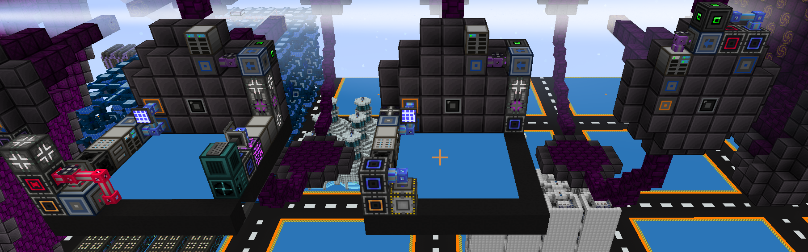

### Subnet 1 - QGP Output
The purpose of this subnet is to capture the outputs (the "challenge") from the QGP module and give OC an opportunity to cache them. It also collects the QGP produced by the previous cycle. During normal operation, this subnet flushes it's contents to main once per recipe cycle.

Inside the ME drive, place at least one item storage cell and two fluid storage cells. This is because there may be up to 8 fluid types or 7 item types present in this subnet. I used 16384k cells. 

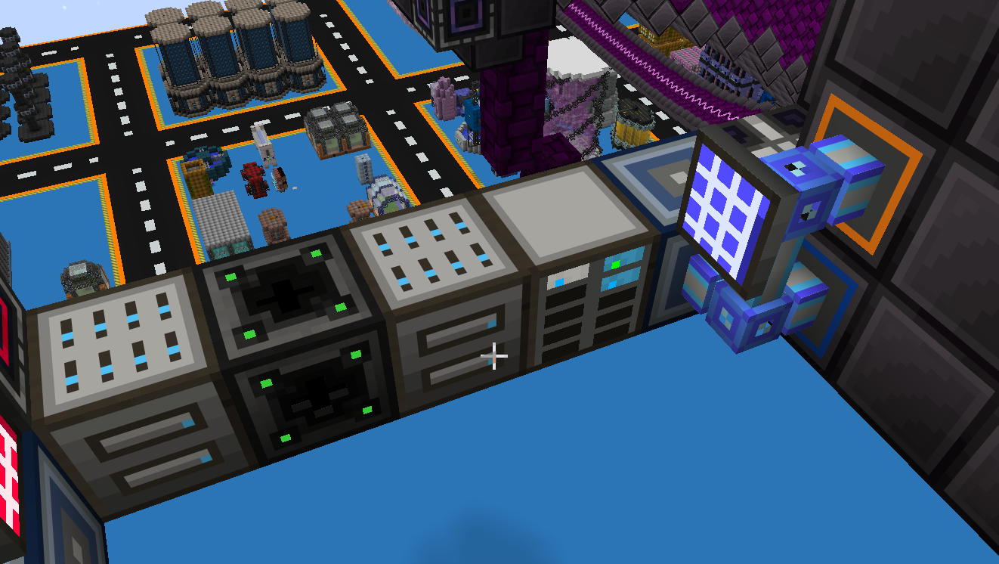

Inside the dual interface, create a paper pattern and name the output "QGP Output". It must be exactly this string. This allows OC to know which subnet is which. 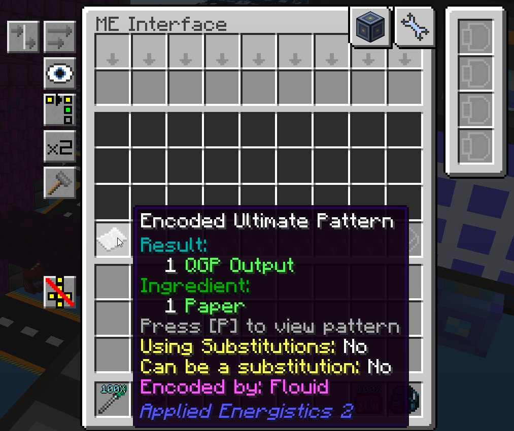

Inside the IO port on the right, copy the following setup exactly. Set it to fill cells, move when work is done, include a superluminal acceleration card, and place a dummy cell in the 5th output slot. You can toss some extra cells in there first so it moves there and then remove them. This dummy cell is there to let OC know which IO port is which.
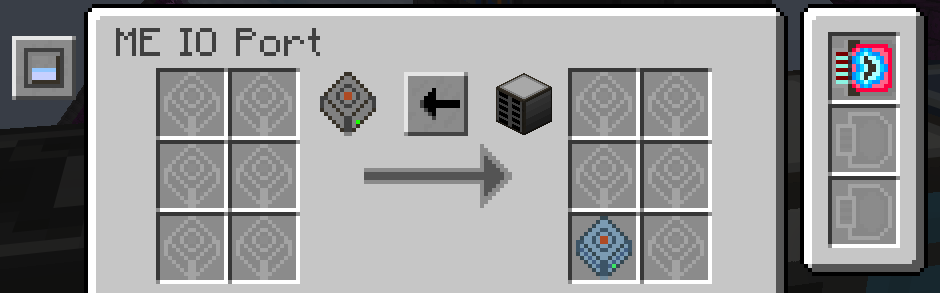

Inside the IO port on the left, copy the following setup exactly. Leave the configuration default, add a superluminal card, and place one 16384k item cell and two 16384k fluid cells insde. The script is expecting exactly 3. 

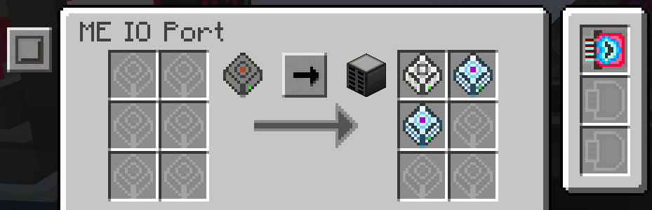

Finally, connect the dual interface to an OC network using an adapter, place a transposer between the two IO ports, and connect the second IO port containing the cells directly to main (colored orange) 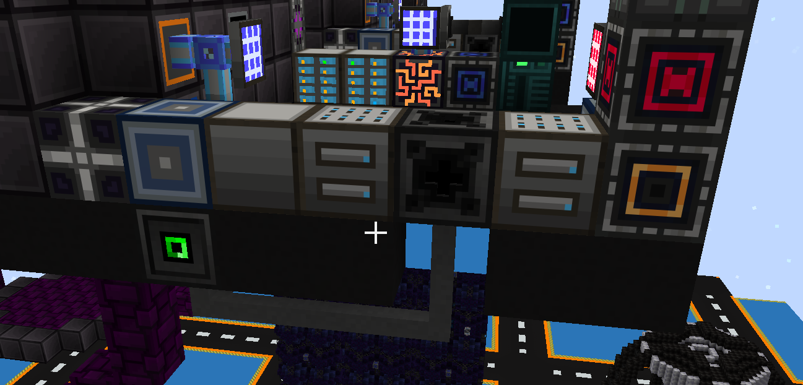

### Subnet 2 - Plasma Storage
The purpose of this subnet is to buffer plasmas and feed the correct amounts as demanded to both modules via ordering patterns. Place a neutronium controller, a wireless hub (connections to this hub will always be blue), and two ME Drives full of 16384k cells. There will be 90 types of plasmas to buffer, so you need at least 18 cells. 

Additionally, place a T3 computer case, computer screen, keyboard, and cable leading to an OC p2p on the plasma subnet. We will deal with the computer setup at the end.

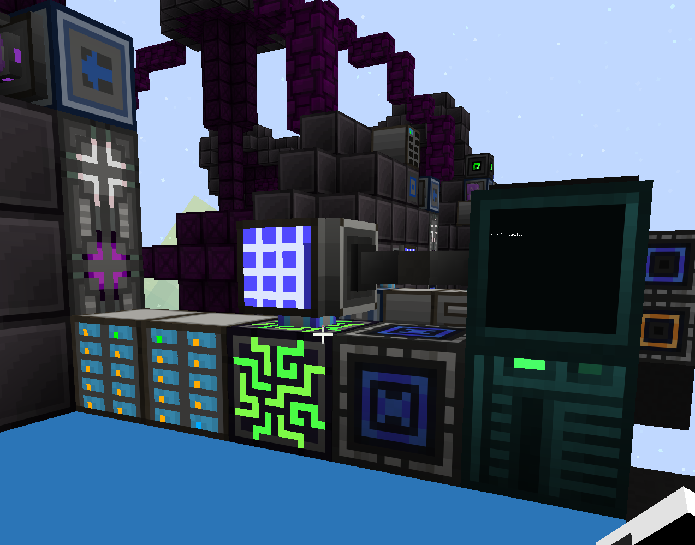

Additionally, for each module we have some components connected to the plasma subnet as well as a tiny subnet for receiving plasmas from the pattern. Pictured is the one for QGP, but the setup is identical for Magmatter. I place the crafting CPU with the module, but this is not necessary. Just ensure the plasma subnet has at least one CPU per module.

Make sure the receiving subnet has enough storage, in this case it needs 7 fluid types available. Feed the plasmas with an advanced stocking input hatch. 

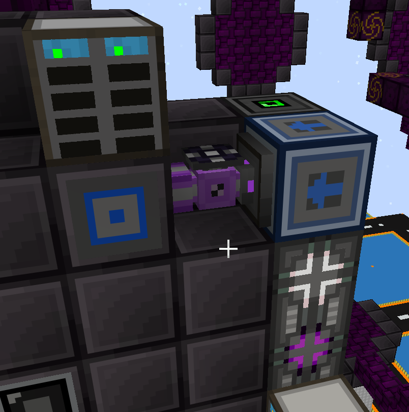

Inside the interface, create another paper pattern named "QGP Input". Again, it must be this exact string. Additionally place a fake crafting card. The script will overwrite this pattern with the plasma inputs and order it.

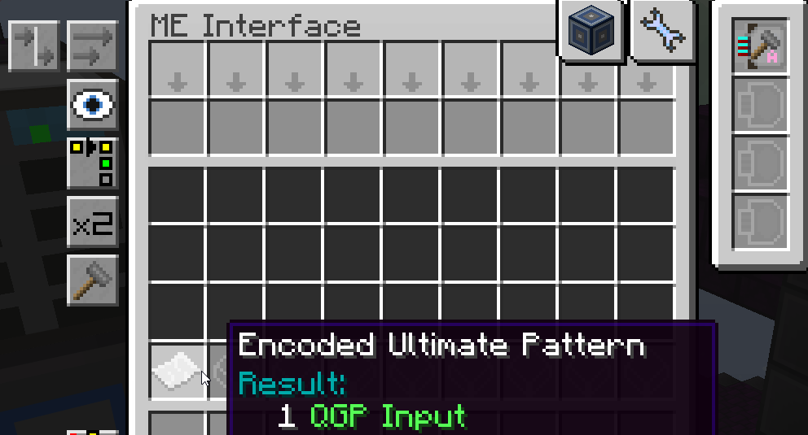

An identical pattern holds for the Exoticizer dedicated to Magmatter.

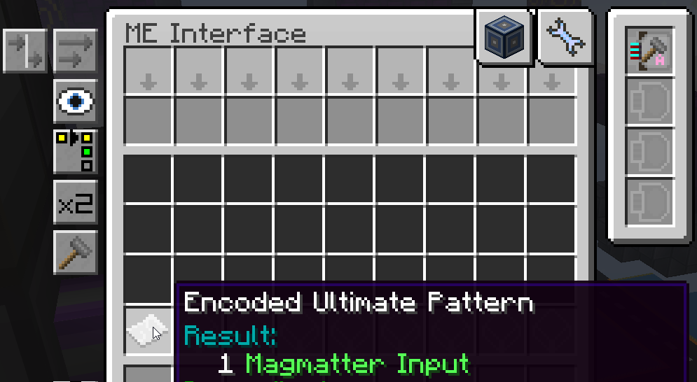

### Subnet 3 - Fabricator
This subnet should have access to all of your bulk storage on main. You can do this with a set of storage busses on an interface, or with super stock replenishers. I opted for the dual interface. In the screenshot, the dual interface is connected to the same orange wireless leading to main from the QGP output subnet. Red cables/wireless indicates the Fabricator subnet. This subnet needs exactly one crafting CPU.

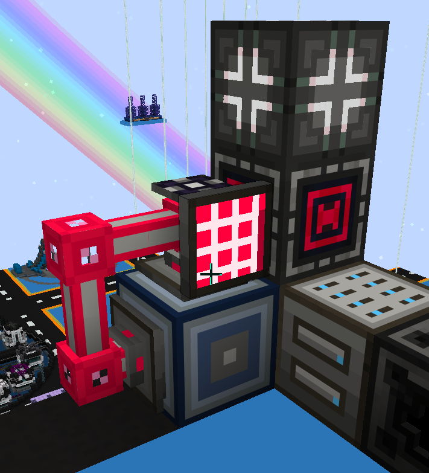

The next screenshot shows the full fabricator setup. The blue wireless is to ferry the output plasma back to it's subnet as well as connect the crafting interface's adapter to OC using p2p. The red wireless is to give the interface access to main's stockpile. A pattern may contain up to 7 item and/or fluid types, so again we need that many types available in storage. Use advanced stocking to supply them to the fabricator

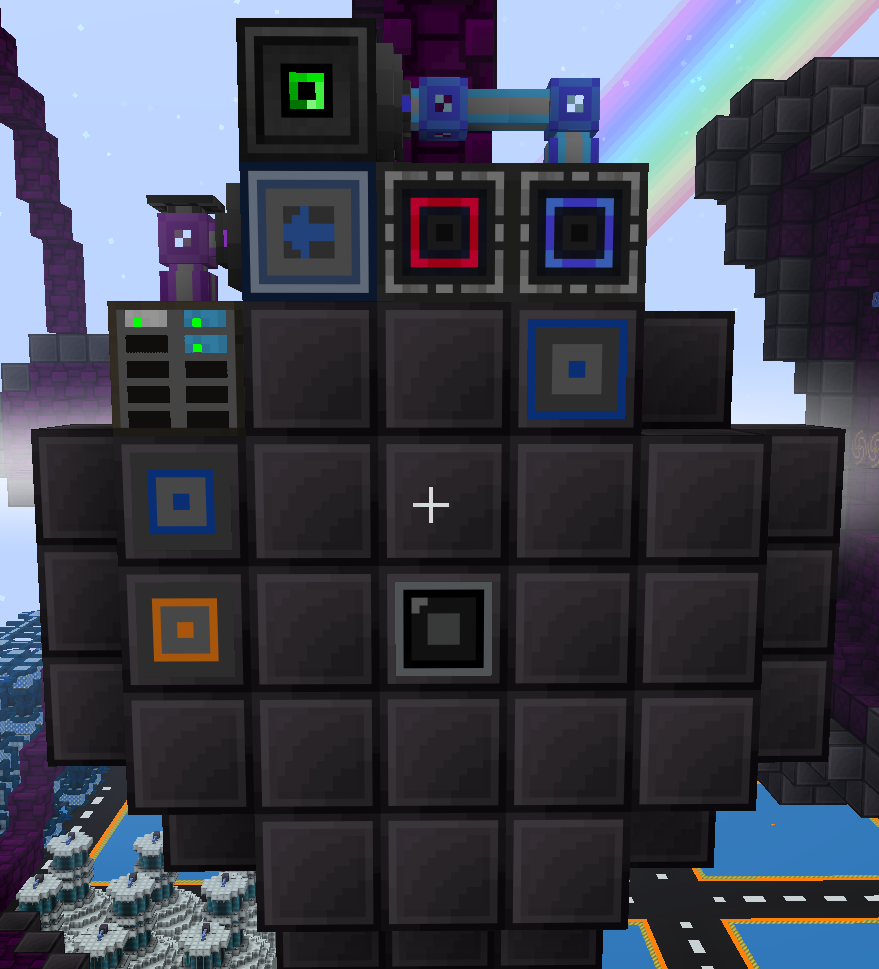

As with the QGP and Magmatter modules, create a pattern pattern with an output named "Fabricator" and add a fake crafting card to the interface. OC will overwrite the inputs and use this pattern to push dusts/fluids into the stocking subnet.

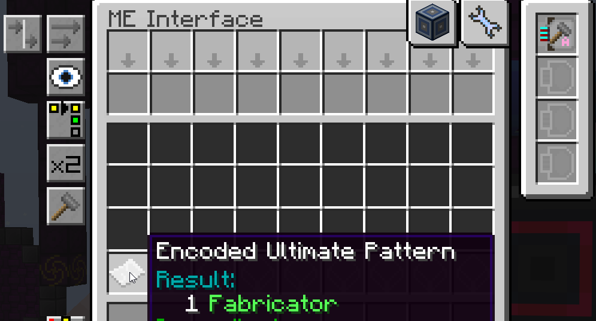

### Subnet 4 - Magmatter Output
The setup for this subnet is nearly identical to the QGP one, so use that as reference. There are only a few key differences. 

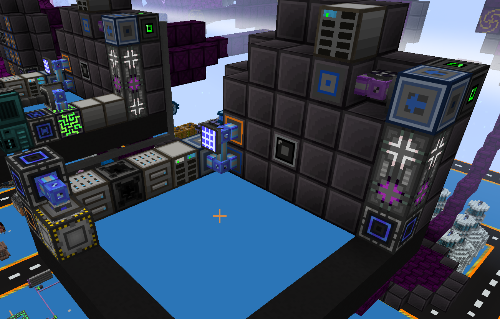

In the right IO port, ensure that the dummy card is in the *last* output slot.

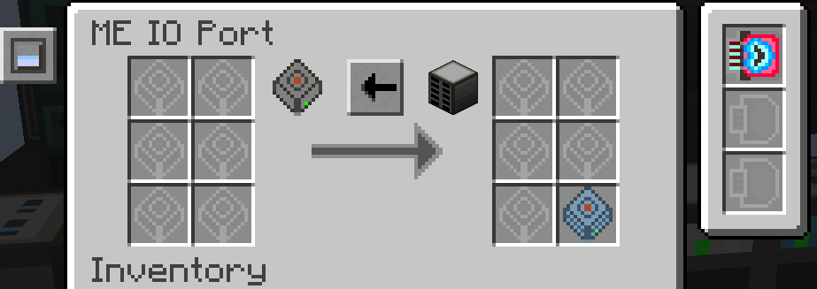

In the left IO port, only place one of each drive type (there is 1 item type and 3 fluid types required). Here, the script expects exactly 2.

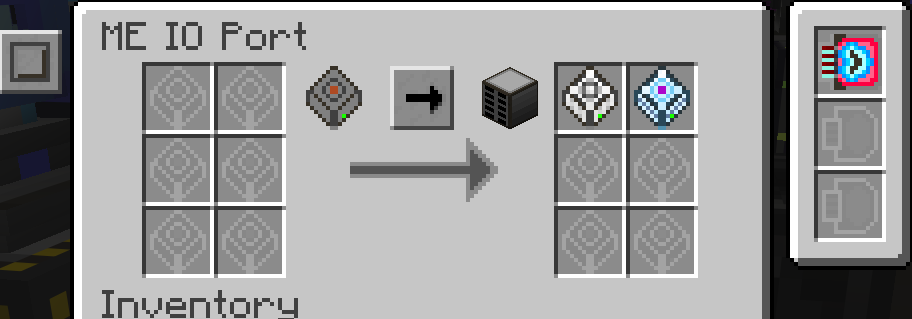

Finally, in order to support magmatter production, the plasma subnet needs access to spatially enlarged fluid and tachyon rich temporal fluid. I chose to supply these via an ME replenisher from main (again, sharing a wireless connection with an IO port) and an EXTRACT-ONLY fluid storage bus to the plasma subnet. All that matters here is that the plasma subnet has access to plenty of both.

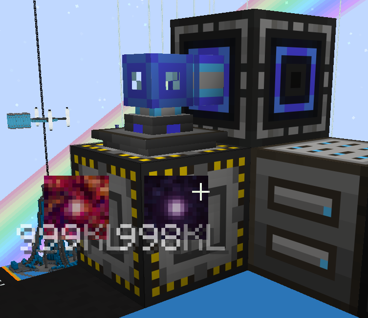

### OC Setup
If everything is done right, this part should be very simple. First, ensure that every interface and both transposers are connected to the computer case via OC cabling. Feel free to use the p2p to bridge gaps as shown.

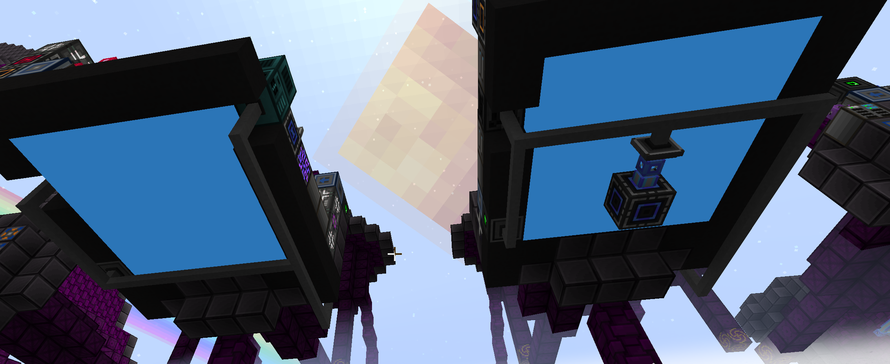

Give the computer all of the following:

- EEPROM with lua bios
- T3 GPU
- Internet Card
- T3 APU
- Magical Memory
- T3 Hard Disk
- OpenOS Floppy

Some of this may or may not be required or can be lower tiers. By the time you're doing this, it should all be cheap though. 

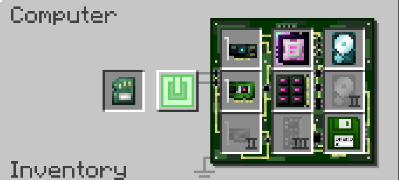

Boot the computer, `install` the operating system, and follow the prompts until you get a shell. Run the following command to download the script and run it. 

`wget https://raw.githubusercontent.com/Flouid/gtnh-gorge-controller/main/gorge-controller.lua && /home/gorge-controller.lua && gorge-controller`

If everything has worked properly, it should immediately start ordering plasmas to fill its buffer according to whatever challenges are present in the output subnets. 

## Common Issues
- If something happens to crash the computer mid-cycle, between the output flush and the plasma feed, you will need to request a new recipe in the module controller. This is extremely rare and shouldn't happen under normal operation. In all other cases, it should gracefully resume on restart.
- If there are ingredients missing to produce a plasma, the script will pause, print a warning about which ingredients are missing and the requested quantity, and wait for the request to be fulfilled. Make sure you have enough of all precursor materials. 
- Probably more, let me know and I'll fix them.

## Configuration Options
- By default, this feeds materials purely as dusts. That's inconvenient, so at the top of the file there is a template for telling it you'd prefer some inputs at fluids instead. Configurations already exist for several of the magmatter exotic materials, and you can feel free to add more.